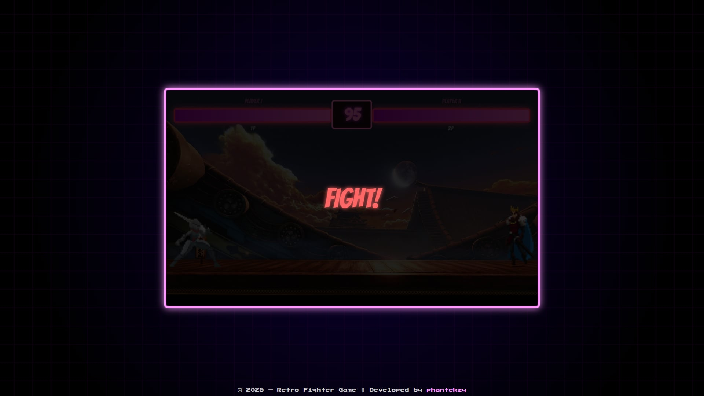
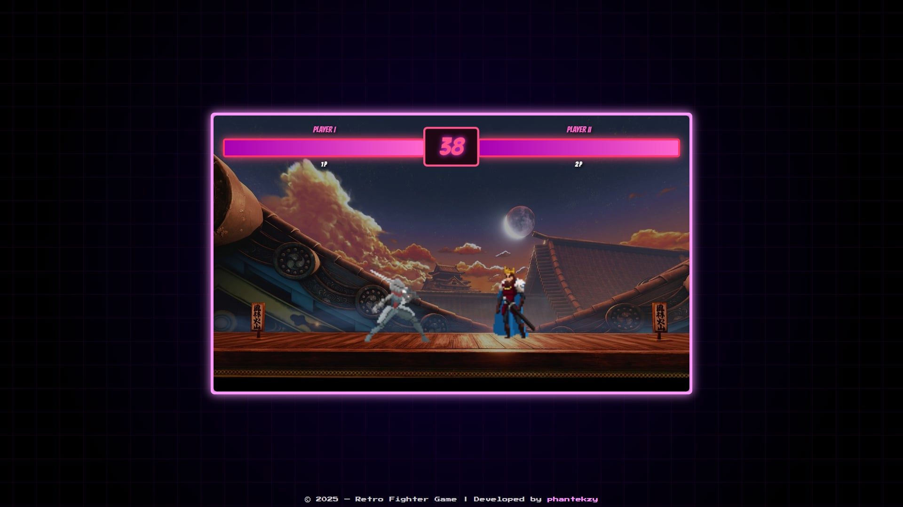

# 🥊 Retro Fighter - 2D Fighting Game

Retro Fighter is a simple, browser-based 2D fighting game built with **HTML5**, **JavaScript**, and the **Canvas API**. The goal is to bring back the spirit of classic arcade fighting games with basic player controls, health mechanics, and visual effects.

---

## 🎮 Game Features

- 🔺 **Two Characters**: Player 1 and Enemy, each with their own hitboxes and health.
- 🗡️ **Attack System**: Attack box logic with collision detection.
- 🧠 **Winner Detection**: Determines a winner based on health or timer expiration.
- ⏲️ **Countdown Timer**: A 100-second game timer that ends the match automatically.
- 💻 **Canvas-Based Rendering**: The game uses the HTML5 `<canvas>` element for drawing and animating characters.
- 🎨 **Sprites Support**: Add your own assets via the `/assets` folder to customize the game's look.

---

## 🚀 Getting Started

### Requirements

- A modern web browser (Chrome, Firefox, Edge, etc.)
- No installations needed (client-side only)
- You can edit the code using any code editor (e.g., VS Code, Neovim)

---

### 🔧 How to Run the Game Locally

1. **Clone the repository**:

   git clone https://github.com/your-username/retro-fighter.git

2. Navigate to the folder:
   cd "D:/fighting game"

3. Open game.html in a browser:

You can double-click game.html

Or open it with a live server if you're using VS Code

🎮 Controls (example, if implemented)
Key Action
A / D Move left/right
W Jump
Space Attack
Arrow Keys Enemy Controls (if applicable)

You can customize the controls by editing game.js.

🧠 Code Explanation
game.js: Handles rendering, player input, health bars, and game logic.

utils.js:

rectangularCollision(): Checks if attack boxes intersect (basic hit detection).

determinWinner(): Compares health and declares a winner.

decreaseTimer(): Countdown timer that ends the match when it reaches zero.

🎨 Customize the Game
You can:

Replace characters with your own sprite sheets.

Add sound effects (attack, hit, win).

Extend the timer or health bar UI.

Improve attack animations.

Assets go into the /assets folder. Update paths in game.js accordingly.

📦 Technologies Used
HTML5 + Canvas API

Vanilla JavaScript

CSS3 (optional enhancements)

🛠️ Future Improvements
Multiplayer controls

Combo attacks and special moves

Score system

Mobile support

🤝 Contribution
Pull requests are welcome! If you find bugs or want to improve the game, feel free to:

Fork the repo

Create a new branch

Make changes

Submit a pull request

📄 License
This project is licensed under the MIT License. Feel free to use, modify, or distribute.

🙌 Acknowledgments
Inspired by old-school fighting games like Street Fighter II and Mortal Kombat

Built as a learning project to understand 2D game development with JavaScript

